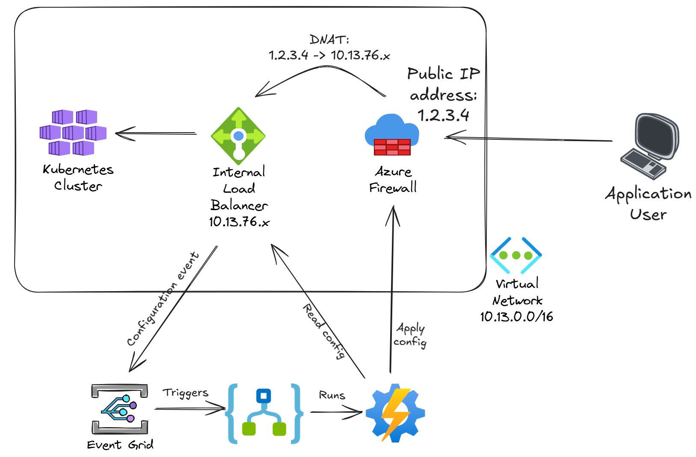

# Synchronization of Azure Firewall DNAT rules to AKS services

This PowerShell script propagates any changes in Kubernetes services that expose applications over internal Azure Load Balancers to DNAT rules in an Azure Firewall policy, so that there is one DNAT rule for every exposed service.

This PowerShell script should be configured as an Azure Automation runbook that is called when Event Grid detects a change in the internal ALB associated to AKS. An Azure Logic App reacting to the event from Event Grid will give you more flexibility than directly configuring the Runbook's webhook in Event Grid:

For more details on how the script works, see a demo here:

The script has no parameters, optionally you can define the AKS cluster name and the Azure Firewall policy data (policy name, rule collection group and rule collection) as parameters.
