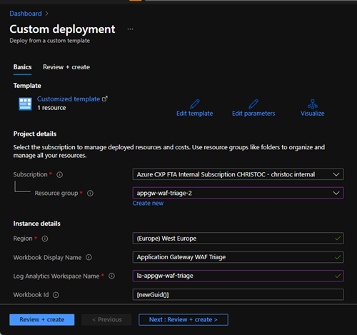

# Application Gateway WAF Triage Workbook

Author: [Christof Claessens](https://github.com/xstof), [Camila Martins](https://github.com/ccmartins) \
Contributor: [Martin Buna](https://github.com/MartinBuna)

# Quick deploy to Azure

## WAF Triage Workbook - using AzureDiagnostics table

## WAF Triage Workbook - using Resource specific tables
This template uses the resource specific tables AGWAccessLogs and AGWFirewallLogs.\

# Description

This workbook visualizes Application Gateway WAF rule violations and helps with triaging those so to facilitate tuning the WAF against valid traffic.

This workbook is designed to parse WAF logs from Application Gateway WAF V2 configured with WAF Policy.

Often companies struggle to parse the logs from the Application Gateway Web Application Firewall and triage them to determine which ones are true violations and which ones are false positives.  Especially during the design phase of an application, it is important to review these logs and make sure to adapt the application and/or WAF configuration so to eliminate false positives.  This is where this workbook might help.  
 
_For additional information and step by step deployment guide and usage, see this [blogpost in TechCommunity](https://techcommunity.microsoft.com/t5/azure-network-security-blog/introducing-the-application-gateway-waf-triage-workbook/ba-p/2973341)_  
  

## Deploying the Workbook

To deploy this workbook, click the button "Deploy to Azure".  Fill in the requested parameters:

- `Workbook Display Name`: the name of the workbook as it will be shown in the portal
- `Workbook Source Id`: the full Resource ID of the Log Analytics workspace you want to link to workbook to.  Example of a value: /subscriptions/'GUID'/resourcegroups/'RG Name'/providers/microsoft.operationalinsights/workspaces/'Workspace Name'

Then click "Review + create".

_**Note**: If you need to use the transaction ID in the ApplicationGatewayAccessLog, then replace "host_s" with "originalHost_s" in the join between ApplicationGatewayAccessLog and ApplicationGatewayFirewallLog.

## Contributing

This project welcomes contributions and suggestions.  Most contributions require you to agree to a
Contributor License Agreement (CLA) declaring that you have the right to, and actually do, grant us
the rights to use your contribution. For details, visit https://cla.opensource.microsoft.com.

When you submit a pull request, a CLA bot will automatically determine whether you need to provide
a CLA and decorate the PR appropriately (e.g., status check, comment). Simply follow the instructions
provided by the bot. You will only need to do this once across all repos using our CLA.

This project has adopted the [Microsoft Open Source Code of Conduct](https://opensource.microsoft.com/codeofconduct/).
For more information see the [Code of Conduct FAQ](https://opensource.microsoft.com/codeofconduct/faq/) or
contact [opencode@microsoft.com](mailto:opencode@microsoft.com) with any additional questions or comments.
