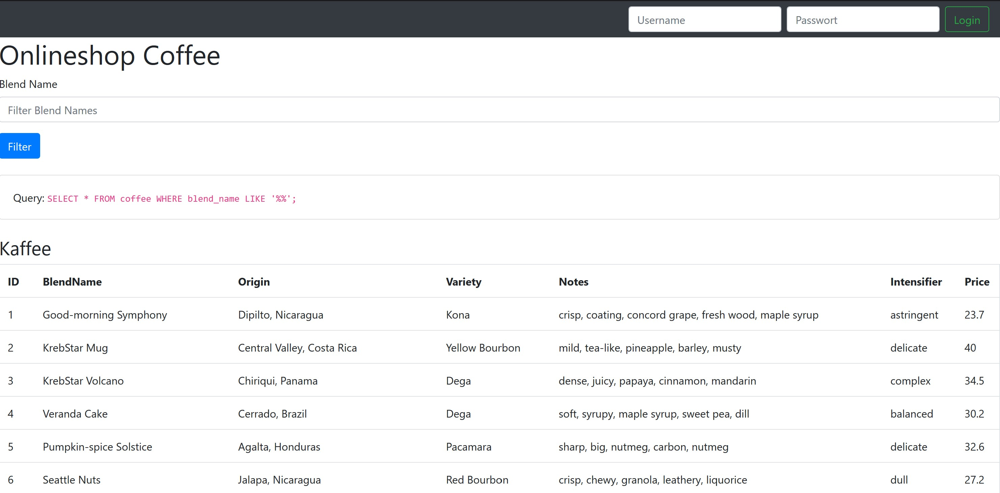

# Demo SQL Injection

<p align="center">
  <a href="#"></a>
</p>

This Coffeeshop app is used to demonstrate the sql injection and cross site scripting vulnerabilities. In this project, all database queries used are intentionally vulnerable to SQL injection. The original Coffeeshop app can be found [here](https://github.com/lebalz/sql-injection-demo)

### Filter
The listed products can be filtered by the `Blend Name`. The user input is not sanitized what makes it vulnerable for sql injections.
* sort or filter by custom attribute
* edit entries
* drop table
* drop database
* list users from other table
* ...

### Login
The login is also not protected against sql injection.
A logged in user can add items to his cart; a user with admin privileges can additionally delete items.
* login without any credentials
* login as admin
* give a user admin privileges
* ...

### Recreate initial state

At the bottom of the page, there is a button
  <span></span>, which restores a pristine db state.

## Setup

Create in mysql a new user `sql_injection` and grant him all privileges only for the database `inject_demodb`. It's important to ensure no other databases are affected by the sql injection vulnerability.

```SQL
CREATE USER 'sql_injection'@'%' IDENTIFIED BY 'foobar';
GRANT ALL PRIVILEGES ON `inject_demodb` . * TO 'sql_injection'@'%';
FLUSH PRIVILEGES;
```

Create the Database `inject_demodb`:

```SQL
CREATE DATABASE inject_demodb;
```

Edit the `$host` in the file [connectdb.php](lib/connectdb.php).

The database `host`, `port`, `username` and `password` can be set over the following environment variables (in case you want to deploy it to a server):

```sh
SQL_INJECTION_DB_HOST="localhost"
SQL_INJECTION_DB_PORT="3306"
SQL_INJECTION_DB_USERNAME="sql_injection"
SQL_INJECTION_DB_PASSWORD="foobar"
```

Then serve `index.php` and click the a button `Recreate Table` which will create the table `coffee` in your database and seed some data. The data was created with the [faker-gem](https://github.com/stympy/faker) by @stympy.


## Dokku deploy

With dokku, the propper db management is handled by dokku itself when linking the app to mysql. The linking sets an ENV-Variable 'DATABASE_URL' which is then used to for the db connection.

```sh
$APP='sql-injection-demo'
dokku apps:create $APP
dokku mysql:create $APP
dokku mysql:link $APP $APP

dokku config:set --no-restart myapp DOKKU_LETSENCRYPT_EMAIL=your@email.tld
dokku letsencrypt $APP

# optional expose $APP
dokku mysql:expose $APP
```
